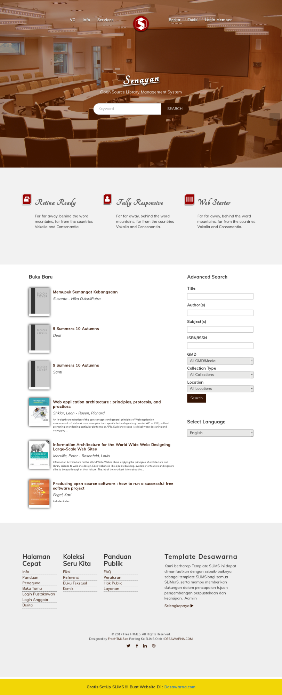

#Template SLiMS 8 : Desawarna Teh

Template ini adalah template HTML yang saya unduh dari   A [FreeHTML5.co](http://freehtml5.co/) saya redesain ulang dengan konsep bungkus teh celup :smile: , penggantian font , warna dan efek santai. Dari HTML tadi kemudian saya porting ke php sehingga dapat digunakan ke dalam SLIMS 

Untuk menggunakan nya / cara install template SLiMS 8.3.x desawarna_teh :
1. Download 
2. Ekstrak ke `slims8_akasia/template/`
3. Login ke admin SLiMS , aktifkan template dengan mengeklik `System > Theme > Pada Template desawarna_teh klik > Activate`
4. Selamat menikmati desawarna_teh